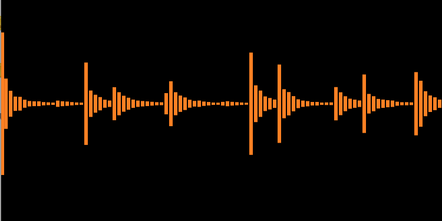
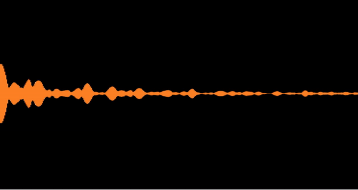

# Audio Armada 
#### The beginnings of an iOS audio toolkit 

I'm starting this as a test bed for mobile audio and framework design. Hopefully it gets to a point that developers can use it in their own applications. 

## Classes
**WaveformZoomable** - draw zoomable waveforms from audio files with multiple styles (detailed or Soundcloud-like)

**WaveformRolling** - like WaveformZoomable, but designed for rolling (live) waveforms with variable history

**More TBD...**

## Examples
The examples are contained in the `AudioArmadaExamples` project. Just open the workspace and run the contained project.

## Installation

### Carthage

Add the following to your project's `Cartfile`:

`github "cwalo/AudioArmada" "master"`
